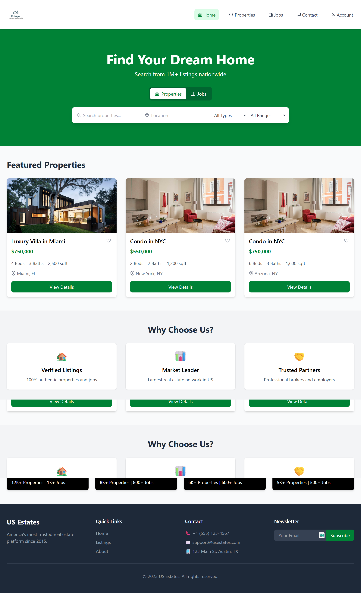
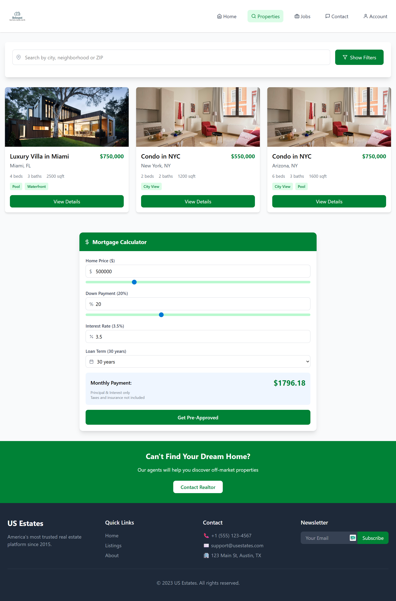
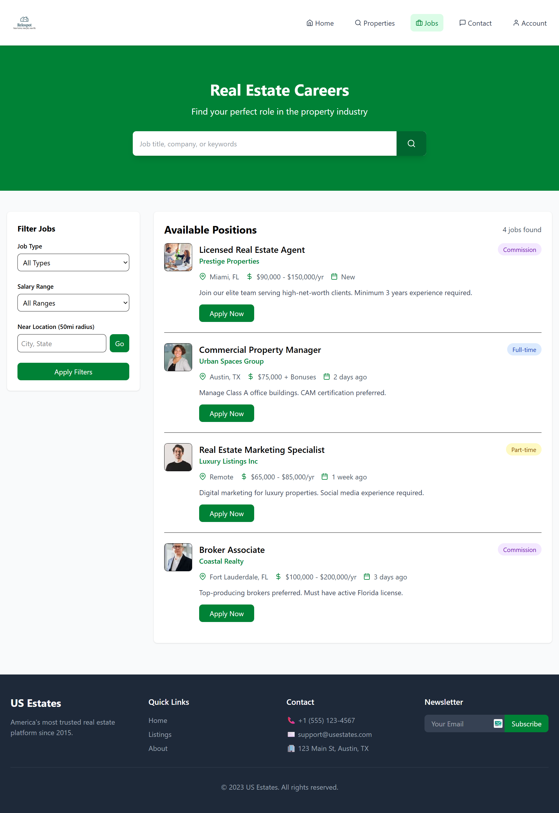

# Real Estate & Job Portal 🏡💼

A comprehensive platform for property listings and real estate career opportunities, combining Zillow-like property search with Indeed-style job listings.

## 🔗 Live Demo
[View Live Project](https://ali-developer-06.github.io/relospot)

## ✨ Key Features
- **Dual-Purpose Platform**: Search properties and jobs in one place
- **Advanced Filters**: 
  - Property: Price range, location, property type
  - Jobs: Salary range, job type, location
- **Save Favorites**: Bookmark properties and jobs
- **Responsive Design**: Works on all devices
- **Trending Markets**: Discover hot real estate markets
- **Professional UI**: Clean, modern interface

## 🛠️ Technology Stack
| Category       | Technologies Used |
|----------------|-------------------|
| Frontend       | React, Tailwind CSS, React Icons |
| State Management | React Hooks |
| Routing        | React Router |
| Data Handling  | JSON (local data files) |
| Build Tool     | Vite (or Create-React-App) |

## 📂 Project Structure

relospot/
├── public/
├── src/
│ ├── assets/Images
│ ├── Components/
│ |  ├── Pages/
│ |  │ ├── Home.jsx
│ |  │ ├── Properties.jsx
│ |  │ └── Jobs.jsx
│ |  ├── Footer.jsx
│ |  ├── Navbar.jsx
│ ├── App.jsx
│ └── main.jsx
│ └── index.css
├── package.json
└── README.md

## 📸 Screenshots
| Home Page | Property Details | Job Listings |
|-----------|------------------|--------------|
|  |  |  |

## 🌟 Upcoming Features
- [ ] User authentication
- [ ] Map view for properties
- [ ] Job application tracking
- [ ] Dark mode toggle
- [ ] Saved searches

## 🤝 Contributing
Contributions are welcome! Please follow these steps:
1. Fork the project
2. Create your feature branch (`git checkout -b feature/AmazingFeature`)
3. Commit your changes (`git commit -m 'Add some amazing feature'`)
4. Push to the branch (`git push origin feature/AmazingFeature`)
5. Open a Pull Request

## 📄 License
Distributed under the MIT License. See `LICENSE` for more information.

## 📧 Contact
Gmail - [alideveloper066@gmail.com](alideveloper066@gmail.com)
Linkedin - [https://www.linkedin.com/in/ali-developer-679abc](https://www.linkedin.com/in/ali-developer-679abc)

Project Link: [https://ali-developer-06.github.io/relospot/](https://ali-developer-06.github.io/relospot/)